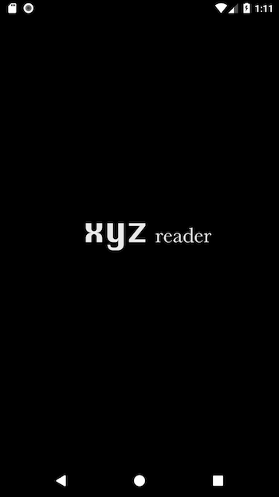
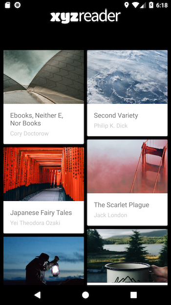

This project involves redesigning an app based on Material design guidelines. The started code is provided by Udacity. XYZreader is a mock RSS feed reader. 

*	Revitalized the app using surfaces, animation, spacing, custom font and color following Material Design principles 
*	Used animations (After Effects, Lottie) and activity transitions (Slide, Shared Element) to make the app more intuitive 
*	Integrated CoordinatorLayout, AppBarLayout and CollapsingToolbarLayout so that background image in Toolbar have parallax effect as it collapses while scrolling for a dynamic user interface and visual aesthetic

## Libraries
* [Lottie](http://airbnb.io/lottie/)
* [Color Palette API](https://developer.android.com/training/material/palette-colors.html)

## UI Component
* [CollapsingToolBar](https://developer.android.com/reference/android/support/design/widget/CollapsingToolbarLayout.html)
* [CoordinatorLayout](https://developer.android.com/reference/android/support/design/widget/CoordinatorLayout.html)
* [recyclerView](https://developer.android.com/reference/android/support/v7/widget/RecyclerView.html)
* [SharedElementTransition](https://android-developers.googleblog.com/2018/02/continuous-shared-element-transitions.html)
* [FloatingActionButton](https://developer.android.com/reference/android/support/design/widget/FloatingActionButton.html)
* [View Pager](https://github.com/codepath/android_guides/wiki/ViewPager-with-FragmentPagerAdapter)

